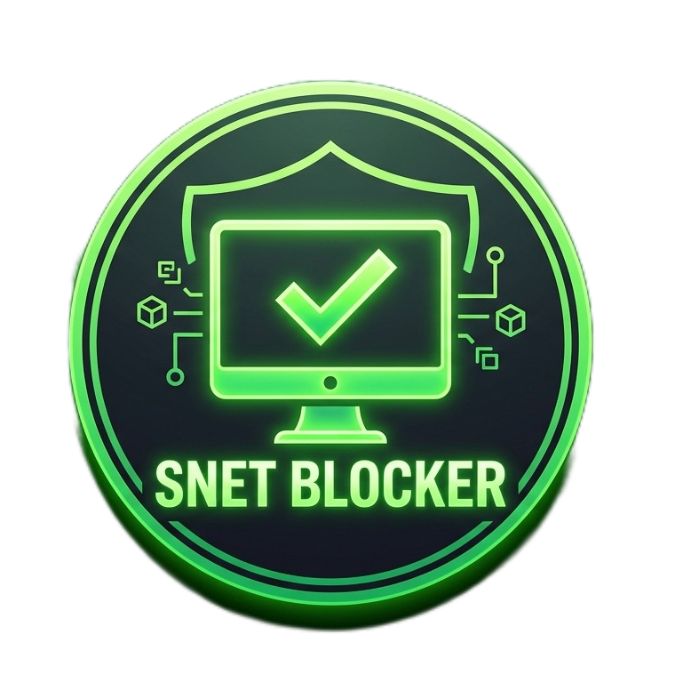

<div align="center">



# SNet Blocker

**A Zero-Trust Chrome Extension for Real-Time Threat Intelligence & Phishing Detection**


[](https://developer.chrome.com/docs/extensions/)
[](https://nodejs.org/)
[]()

*Built by **Reyan Dabre***

</div>

---

## What is SNet Blocker?

SNet Blocker is a premium, privacy-first Chrome extension that enforces a **Zero-Trust browsing model** — meaning no site is trusted by default. It combines real-time DOM scanning, heuristic email phishing detection, and a cross-device blocklist engine to give you full control over your digital security environment.

Unlike traditional ad blockers or parental controls, SNet Blocker actively analyzes page content, email metadata, and domain reputation in real time — not just URL pattern matching.

---

## Feature Highlights

| Feature | Description |
|---|---|
| 🔍 **Content Intelligence** | Scans active tab DOM for adult, gambling, and malware keywords with threshold-based scoring |
| 📧 **Phishing Shield** | Heuristic email scanner for Gmail — auto-runs or accepts manual "Show Original" paste |
| 📊 **Threat Radar UI** | Animated glassmorphism dashboard visualizing domain security state |
| 🛡️ **Dynamic Blocklist** | Add/remove domains from Blocked or Trusted lists in real time |
| 🔄 **Mutation Observer** | Catches threats in AJAX-loaded and infinite-scroll content |
| 📡 **Cross-Device Sync** | Background engine syncs blocklists via server for persistent protection |
| 🔒 **Local-First Privacy** | All content scanning runs on-device — no data leaves your machine |

---

## Architecture Overview

```
SNet-Blocker-main/
│
├── extension/                  # Chrome Extension (Frontend)
│   ├── manifest.json           # Extension config & permissions
│   ├── background.js           # Service worker — central message hub & blocking engine
│   ├── content.js              # Real-time DOM/URL keyword scanner (injected into tabs)
│   ├── gmailScanner.js         # Gmail phishing detection (auto + manual modes)
│   ├── rule.js                 # Domain rule management (add/remove block/trust)
│   ├── app.js                  # Dashboard UI logic
│   ├── auth.js                 # User authentication (Login / Signup)
│   ├── menu.html               # Main glassmorphism dashboard
│   ├── blocked.html            # Interstitial page shown on blocked sites
│   ├── style.css               # Premium design system with CSS transitions & blur
│   └── SNet-Logo.png           # Branding asset
│
├── server/                     # Backend API (Node.js + Express)
│   ├── server.js               # Express entry point
│   └── firewall.js             # Server-side security & blocklist logic
│
├── native-host/                # Optional: Native Messaging Host
│   ├── install.bat             # Windows registry setup
│   └── snet_launcher.bat       # Native bridge script
│
├── snet-db.sql                 # Database schema
├── start-server.bat            # One-click server launcher (Windows)
└── README.md
```

---

## Installation & Setup

### Prerequisites

- **Node.js** v16 or higher
- **MySQL** or **PostgreSQL** database
- **Google Chrome** (latest stable)

---

### 1. Backend Server

```bash
# Navigate to the server directory
cd server

# Install dependencies
npm install

# Create and configure your environment file
cp .env.example .env
# → Edit .env with your database credentials
```

**`.env` template:**
```env
DB_HOST=localhost
DB_PORT=3306
DB_USER=your_user
DB_PASSWORD=your_password
DB_NAME=snet_db
PORT=3000
```

```bash
# Set up the database
# Run snet-db.sql in your MySQL/PostgreSQL client

# Start the server (Windows)
start-server.bat

# Or start manually
node server.js
```

---

### 2. Chrome Extension

1. Open Chrome and go to `chrome://extensions/`
2. Enable **Developer Mode** (toggle in the top right)
3. Click **Load unpacked** and select the `extension/` folder
4. Pin **SNet Blocker** to your Chrome toolbar

> The extension connects to your local backend automatically. Ensure the server is running before browsing.

---

## Module Deep Dive

### 🛡️ Content Intelligence — `content.js`

Injected into every active tab, this module runs a multi-layer threat scan:

- **Keyword Analysis** — Maintains curated keyword sets for adult content, gambling, and malware indicators
- **Threshold Scoring** — Requires multiple keyword matches before flagging, dramatically reducing false positives
- **Mutation Observer** — Hooks into dynamic page updates (AJAX, infinite scroll) to scan newly injected DOM nodes in real time
- **Instant Signaling** — Flags are sent to `background.js` for immediate blocking action

---

### 📧 Phishing Shield — `gmailScanner.js`

A two-mode heuristic scanner targeting email-based social engineering:

**Auto Mode (Gmail)**
- Activates automatically on `mail.google.com`
- Extracts sender address, subject line, and email body
- Produces a **Safe Score** using the heuristics below

**Manual Mode (Any Provider)**
- User pastes raw email data ("Show Original") into the dashboard
- Full heuristic analysis is run on-demand

**Detection Heuristics:**

| Signal | What It Detects |
|---|---|
| Urgency phrases | "Account Suspended", "Immediate Action Required", etc. |
| Brand impersonation | "Bank" / "PayPal" sender from a non-matching domain |
| Suspicious link anatomy | Abnormally long URLs, hidden `@` symbols in href targets |
| Domain mismatch | Display name vs. actual sender address discrepancy |

---

### 📊 Threat Radar Dashboard — `menu.html` + `style.css`

The central command interface, built with a premium glassmorphism design system:

- **Animated Radar** — Visual representation of the current domain's threat level
- **Rule Management** — Add any domain to Blocked or Trusted lists with one click
- **Session Stats** — Live count of threats blocked this session
- **Lifetime Counter** — Cumulative threats blocked since installation

---

### ⚙️ Background Engine — `background.js`

Acts as the extension's central nervous system:

- Receives threat flags from `content.js` and `gmailScanner.js`
- Applies and updates Chrome's Declarative Net Request (DNR) blocking rules
- Communicates with the backend server to sync blocklists across devices
- Manages extension lifecycle events (install, update, tab activation)

---

## Security Design Principles

**Privacy First**
All content scanning is performed locally on the user's machine. Raw page content is never transmitted to external servers.

**Zero-Trust by Default**
No domain is implicitly trusted. Every site is evaluated against current block rules and active keyword scans.

**Pre-whitelisted Essential Services**
Critical services (Google, GitHub, and others) are whitelisted out of the box to prevent workflow interruption, with user-overridable control.

**Transparent Blocking**
When a site is blocked, the user sees a clear interstitial (`blocked.html`) explaining why, with an option to override.

---

## Tech Stack

| Layer | Technology |
|---|---|
| Extension | Chrome MV3, Vanilla JS, CSS3 |
| Backend | Node.js, Express |
| Database | MySQL / PostgreSQL |
| Communication | Chrome Native Messaging (optional) |
| Design | Glassmorphism, CSS Transitions & Blur |

---

## Contributing

Pull requests are welcome. For major changes, please open an issue first to discuss what you would like to change.

1. Fork the repository
2. Create your feature branch: `git checkout -b feature/your-feature`
3. Commit your changes: `git commit -m 'Add your feature'`
4. Push to the branch: `git push origin feature/your-feature`
5. Open a Pull Request

---

## License

This project is licensed under the MIT License. See `LICENSE` for details.

---

<div align="center">

Made by **Reyan Dabre**

</div>
